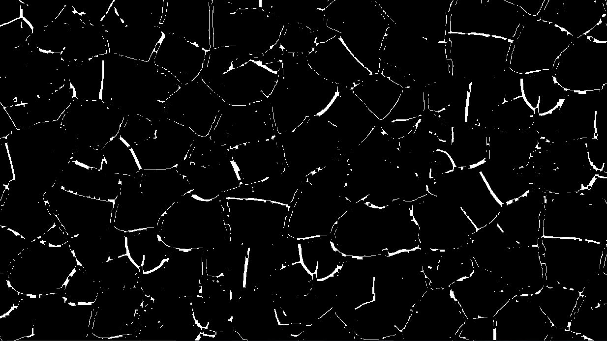

#  PYTHON CRACK DETECTION

This project uses OpenCV, numpy and scipy library for crack detection on the wall.

## Demo

Before:

After:

## Programming language:

- Python

## Libraries Used:

- OpenCV
- numpy
- scipy